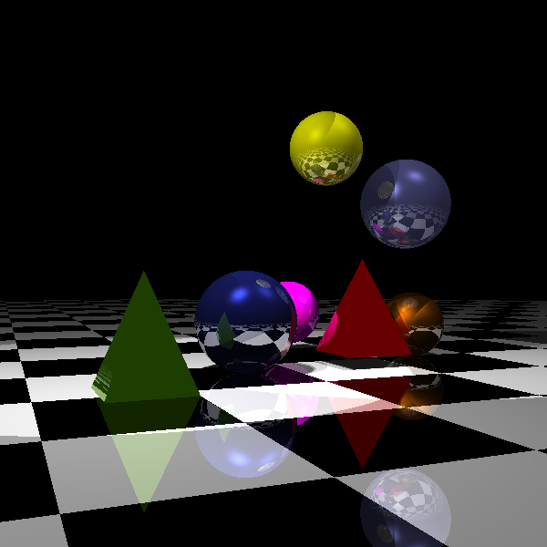
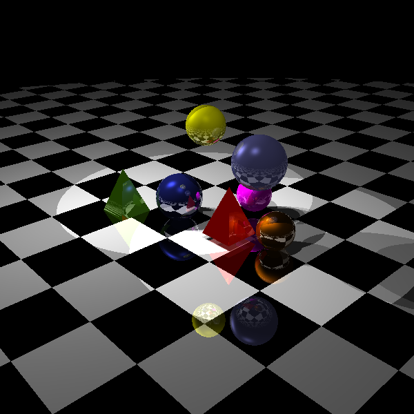

# Ray Tracer

This is a simple ray tracer written in C++ using OpenGL's GLUT for creating display. It supports rendering scenes with **spheres**, **pyramids**, and **checkerboards**, and can handle **point lights** and **spotlights** with shadows, reflections, and Phong illumination.

---

## 📦 Prerequisites

Before building and running this project, ensure you have the following installed:

* **g++** (with C++17 support)
* **Make**
* **OpenGL** development libraries:

  * `libgl1-mesa-dev`
  * `freeglut3-dev`
  * `libglu1-mesa-dev`

You can install them on Debian/Ubuntu-based systems using:

```bash
sudo apt update
sudo apt install g++ make libgl1-mesa-dev freeglut3-dev libglu1-mesa-dev
```

---

## 🔧 Build Instructions

To build the ray tracer:

```bash
make
```

This will compile the source files and create an executable called `raytracer`.

To clean up compiled files:

```bash
make clean
```

---

## ▶️ Run Instructions

To run the ray tracer with a scene description in `input.txt` and output the image to `out.bmp`:

```bash
make run
```

This internally runs:

```bash
./raytracer --input input.txt --output out.bmp
```

It is also possible to provide a texturer image for the checker board.

```bash
./raytracer --input input.txt --output out.bmp --texture texture.bmp
```

Ensure your `input.txt` is correctly formatted (see below).

---

## 📝 Sample `input.txt` Explanation

Here's a breakdown of the input file structure:

```
<near> <far> <fovY> <aspectRatio>

<recursion-level>
<image-resolution>

<checkerboard-width>
<ambientR> <diffuseR> <reflectionR>

<number-of-objects>

<object-type>
<object-parameters...>
...
<object-type>
<object-parameters...>

<number-of-point-lights>
<x> <y> <z> <falloff>

<number-of-spot-lights>
<x> <y> <z> <falloff>
<lookX> <lookY> <lookZ>
<cutoff-angle>
```

Object types supported:

* `sphere`
* `pyramid`

Each object and light entry must follow the correct number of parameters as shown in the example.

---

## 🖼️ Sample Output

Here are some sample rendered images from a provided scene.





